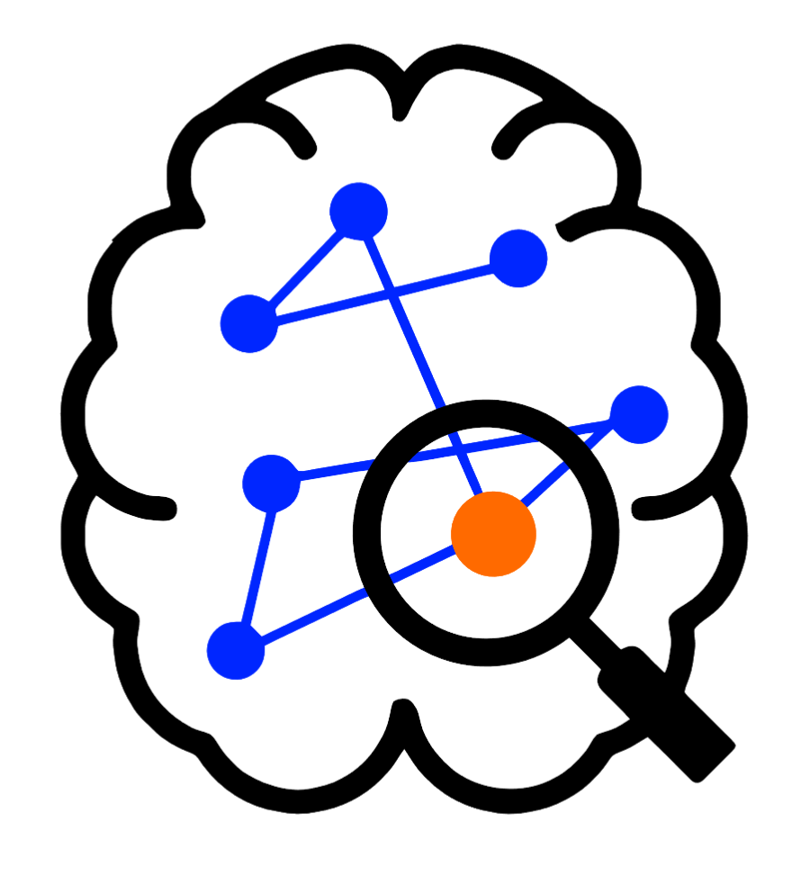
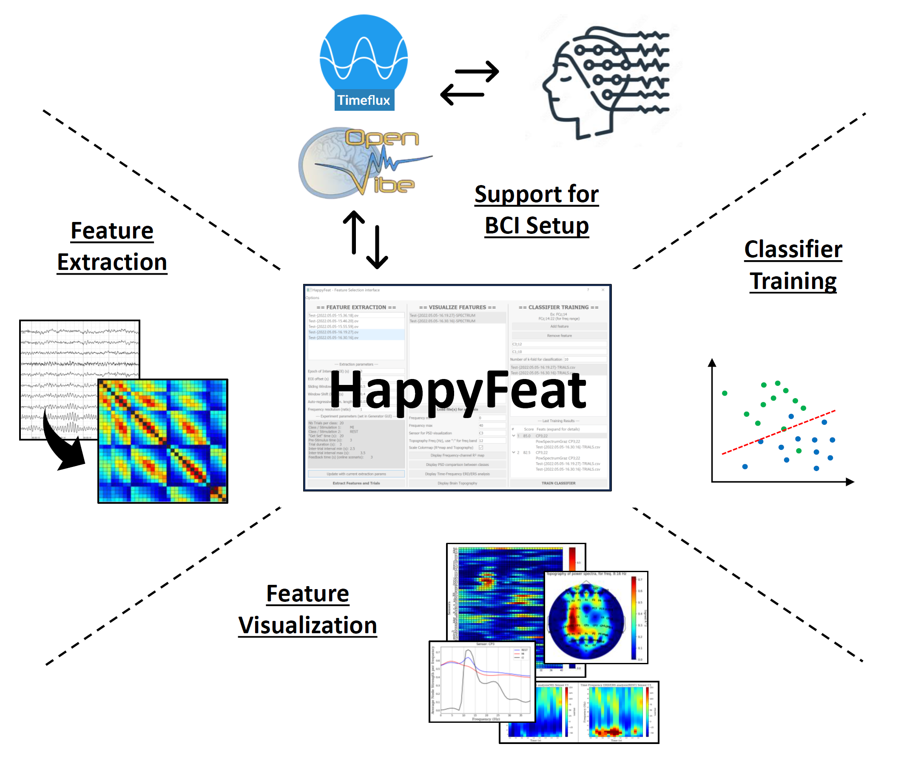

# [HappyFeat](https://github.com/Inria-NERV/happyFeat) - Interactive framework for clinical BCI applications

	

!!! warning "Testers and feedback wanted!"
	Reach out and give us your opinion, ideas for improvement, and to [open issues](https://github.com/Inria-NERV/happyFeat/issues) for bugs or missing features!
	
***[HappyFeat](https://github.com/Inria-NERV/happyFeat)*** is a software aiming to to simplify the use of BCI pipelines in clinical settings. More precisely, it is a **software assistant for extracting and selecting classification features for BCI**.

It gathers all necessary manipulations and analysis in a **single convenient GUI**, and **automates experimental or analytic parameters**. The resulting workflow allows for effortlessly **selecting the best features**, helping to achieve good BCI performance in time-constrained environments. Alternative features based on **Functional Connectivity** can be used and compared or combined with Power Spectral Density, allowing a network-oriented approach. 

It consists of **Qt-based GUIs and Python toolboxes**, allowing to realize all steps for customizing and fine-tuning a BCI system: **feature extraction & selection, classifier training**.

***HappyFeat*** also allows to interface with BCI softwares (*OpenViBE* and *Timeflux*) in order to facilitate the whole BCI workflow, from data acquisition to online classification.

The focus is put on ease of use, trial-and-error training of the classifier, and fast and efficient analysis of features of interest from BCI sessions.

???+ warning 
    ***HappyFeat*** is still under development, and may undergo significant changes in the near future.

# Requirements

* **Python 3.12**
* Python packages : shutils / PySide6 / numpy / MNE / matplotlib / scipy / spectrum / statsmodel / pandas / ruamel.yaml / plotly
* **OpenViBE Version 3.6.0**: http://openvibe.inria.fr/downloads/
* .. and/or **Timeflux Version 0.16.0**: https://doc.timeflux.io/en/stable/usage/getting_started.html#installation

# Key Features

* **Easy to use GUI** allowing to extract and visualize classification features, and select the most relevant ones for training a classifier.
* Use **Spectral Power** or **Coherence-based** features for classification. HappyFeat allows to extract & visualize both types of features in parallel, and **mix them at the training level**.
* Feature selection and classifier training can be done multiple times in a row, until satisfactory results are achieved.
* A **workspace management system** keeps tracks of all extraction- and training-related manipulations, and enables a high degree of reproducibility.

### Available pipelines: 

* With **OpenViBE**: 
	* Power Spectrum (Burg method)
	* Functional Connectivity: Coherence-based Node Strength (Spectral Coherence, Imaginary part of Coherence)
	* Mixing Both PSD and Connectivity
	* Single-class classification
* With **Timeflux**: 
	* Power Spectrum (Welch method)
	* *more coming soon...*

### Available classifiers:
* LDA

### *Coming soon*

* *More pipelines for Timeflux (Welch-based connectivity Node Strength)*

* *More feature classes, more classification algos*

* *Particle swarm algorithm for determining optimal AutoRegressive model order*

* *Standalone Python software!*
    * *Run the offline analysis (extraction, visualization, selection, training) without the need of a BCI software*